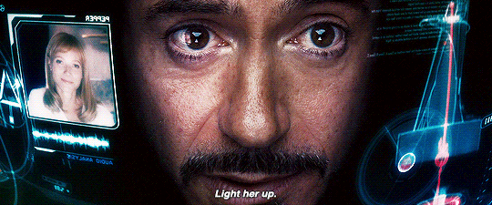

# VasemberPublic


bs = bootstrap

## Előkészületek

1. Hozz létre egy `index.html` fájlt a gyökér mappába
2. Az oldalhozzáadási útmutató alapján add hozzá a következő oldalakat:
   1. name: "Főoldal", link: "index.html"
   2. name: "Vasember", link: "ironman1.html"
   3. name: "Vasember 2", link: "ironman2.html"
   4. name: "Vasember 3", link: "ironman3.html"
3. Készitst el az Index oldalt a HTMl 5 szabványnak megfelelően, és csatold be a `sources\css\custom-bootstrap.css`-t, és a saját css fájlod.
4. Csatold be a sources/css mappábából a `tatarV1.css`-t.
5. Add hozzá a `sources/js/bootstrap.js`, majd a `sources/js/oldalak.js` és végül `sources/js/tatar.js` fájlokat a scriptek részére, a megfelelő sorrendben.
6. Az oldal címét add meg Főoldal néven
### Menü
6. a bodyba add hozzá a `<nav class="navbar navbar-dark navbar-expand-md bg-black" id="navbarMenu"></nav>` elemet. Fontos, hogy a szokással ellentétben ebbe ne szúrd be a bootstrap egyéb menü elemeit, ugyanis ezt a tatar.js script teszi meg. Ez azért szükséges, hogy ne kelljen minden oldalon beállítgatni a menüt.
### Banner
7. Add hozzá egy fejlécet és állítsd be neki a bootstrap `d-flex`, jumbotron, és elemeket középre helyező stílusait Állítsd be neki a `header` azonsoítókijelölőt.
8. helyezz el benne egy div elemet, És bs segítségével old meg a következőket:
   1. a szöveget helyezd középre
   2. jelenjen meg blokkszinten
   3. külső margója legyen automatikus
9.  A divben helyezz el egy első színtű címsort, bs 6 egséges marginnal. 
10. helyezz el egy bekezdést a cím alá, és írd be a kövekező szöveget, és állítsd be a minta szerint a döresezést.`Vasember szerepében: Tony Stark. Filmet rendezte: Happy Közreműködött aszisztens: J.A.R.V.I.S. `
11. Alakítsd linké a `Tony Stark`, `Happy`, és a `J.A.R.V.I.S.` szavakat, és add meg nekik a `forrasok.md`-ben talált hozzájuk tartozó linkeket. A minta szerint add hozzá a `red` `green` és a `jarvis` osztálykijelölőket az elemekhez.
12. A link alá addj hozzá egy linket, melyet alakíts bs segítségével gombbá. A gomb színe legyen info, és betűszíne fehér. A link iránya az `ironman1.html` címre mutasson.
13. Az oldal head részébe adj hozzá stlye tageket, és állítsd be, hogy a header háttérképére a következő vonatkozzon: `linear-gradient(rgba(0, 0, 0, 0.327),rgba(0, 0, 0, 0.3)) , url(sources/img/tonyBg1.jpg)`.
14. Addj hozzá egy láblécet, melynek azonosítója legyen `footer`, osztálykijelőlője legyen bs-el középre igazítva, és `text-lg-start`. Egyebet ne kezd vele, mert nem fog működni.
## Vasember 1
15. Másold le az `index.html`-t, és nevezd át a `ironman1.html`-re, és az oldalcímet is írd át `Vasember`-re.
16. Addj hozzá egy main elemet, és addj hozzá egy main azonosítót, és a bs konténer és 5ös értékű külső margóját.
17. addj hozzá két szakaszt, és mindkettőre állítsd be a bs sor és jumbotron osztályait.
18. A másodikra állíts be egy bg-dark2 osztálykijelölőt.
19. Az első szelekcióba helyezz el egy div-et, és állítsd be bs-el, hogy cella legyen, kis méretű eszközökön 12 oszlopot foglaljon, nagy eszközöktől felfelé 4 oszlopot foglaljon.
20. A divbe helyezz el egy bs responzív bélyegkép legyen, megjelenése flex legyen, és külső margója legyen autómatikus. A kép elérési útja `sources/img/ir1/iromnan1Profil.jfif`. Erre a szakaszra késöbb profil néven fogok hivatkozni.
21. Helyezz el az előző div alá még egy divet, és állítsd be bs-el, hogy cella legyen, kis méretű eszközökön 12 oszlopot foglaljon, nagy eszközöktől felfelé 8 oszlopot foglaljon. Színtén bs használatával állítsd be, hogy a szöveg sorkizárt legyen.
22. A másidok divben helyezz el egy kettes színtű címsort, melyet bs-el helyezd középre.
23. A forrásban talált szöveget tagold bekezdésekre a 2s színtű címsor után
24. A Forrás linkjére állítsd be a `forras-link` osztályt, és a link jelenjen meg új lapon.
25. A második szelekcióba addj hozzá egy div-et, mely legyen egy sima cella, és a szöveg legyen sorkizárt.
26. A `Történet` címnek addj meg egy első színtű címet.
27. Tagold benne sima bekezdésekre a szöveget.
28. Addj hozzá a két szekció alá még egyet. Ez is legyen sor, `bg-dark2`, és a külső margója legyen bs 2 egységes.
29. Ebben helyezz el egy div-et, amely 12 oszlop széles, `bg-dark2`, belső viszintes és függőleges margója 5, és legyen jumbotron.
30. A 3. szekcióba helyezz el egy kettes színtű címsort. A szöveget igazítsd középre.
31. Addj hozzá egy bekezdést, és tedd sorkizártra.
32. Helyezz el egy új konténert, és ennek id-je legyen gallery.
33. A gallerybe vegyél fel egy divet, állítsd be rá, hogy sor A benne lévő cellák kis és közepes méretben 12 nagy és afelett 6 oszlop széles legyen.
34. Ezek után add hozzá a képeket, mint egy egy cella, a következő mintával:
```html
<div class="osztálykijelokok, ne ezt írd be, hanem amit az előző pontban kértem">
    
</div>
```
34. A videót a következő divvel ad hozzá:
```html 
<div class="col-12 col-md-12 col-lg-6">
    <iframe class="img-fluid"
        src="https://www.youtube.com/embed/8ugaeA-nMTc">
    </iframe>
</div>
```
35. Állítsd be a `style` tagekben a háttérkép elérési útját az `sources/img/ir1/ironman1bg.jpg`-re 
### Vasember 2
36. Másold le az `ironman1.html`-t és nevezt és `ironman2.html`-re, és az oldalcímeket is írd át `Vasember 2`-re.
37. Állítsd be a `style` tagekben a háttérkép elérési útját az `sources/img/ir2/tonyWorking.jpg`-re, és a profilkép elérése legyen `sources/img/ir2/ironman2Profil.jpg`
38. A minta és az eddigiek alapján helyezd el a szövegeket, linkeket.
### Vasember 3
39. Másold le az `ironman1.html`-t és nevezt és `ironman2.html`-re, és az oldalcímeket is írd át `Vasember 3`-ra.
40. Állítsd be a `style` tagekben a háttérkép elérési útját az `sources/img/ir3/tonySitWithSuit.jpg`-re, és a profilkép elérése legyen `sources/img/ir3/ironman3Profil.jpg`
41. A minta és az eddigiek alapján helyezd el a szövegeket, linkeket.
## Egyéb utasítások
42.  A képek sorrendje számít, minden szükséges információ a forrásban és a lineknél található. Javaslom kinyitni a képes mappákat a fájl kezelő nagy méretű nézetével. A Wikipédia linkeket és szövegeket igazítsd el a minta és a `linkek.md` alapján. A címeket állítsd be mindenhol az adott oldalnak megfelelően.


# Oldalhozzáadási útmutató

A templateOldal szöveg egy helyettesítő szöveg, az a file név, amit a másolandó.

1. Másold le a `templateOldal.html` fájlt.
2. Írd át a fájl nevét `amitakarsz.html` re.
3. Az `amitakarsz.html`-ben írd át az oldal nevét a `valaszottCim` re.
4. A `sources/js/oldalak.js`-ben a 3. sortól kezdődő listába szórj be még egy objektumot a minta alapján.
```js
    {
        name: "valaszottCim", //Odal megjelenő neve, fontos hogy egyezzen a beállított oldal címmel mert különben nem fogja aktívvá tenni az oldal címet a navbarban
        link: "amitakarsz.html" // Oldal elérésu útja a gyökérhez képest, fontos hogy nem a js file hoz képset. pl: index.html
    }, //fontos hogy egy ilyen blokk után vesszőt tegyünk
```
**Fontos: Az objektum lezárása után mindíg tegyél vesszőt, mert különben elhasal a script!!! Az objektum a két `[   ]` közé kerüljön, pontosan így:**
```js
 const menuPontok = [
    {
        name: "Főoldal", //Odal megjelenő neve, fontos hogy egyezzen a beállított oldal címmel mert különben nem fogja aktívvá tenni az oldal címet a navbarban
        link: "index.html" // Oldal elérésu útja a gyökérhez képest, fontos hogy nem a js file hoz képset. pl: index.html
    }, //fontos hogy egy ilyen blokk után vesszőt tegyünk
    {
        name: "TemplateOldal",
        link: "templateOldal.html"
    },
    {
        name: "valaszottCim",
        link: "amitakarsz.html"
    },
]
```
